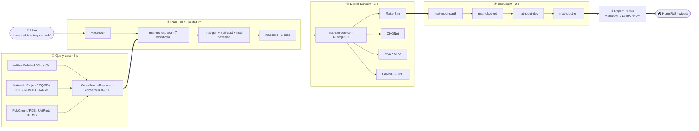

# MatWAU

> A multi-discipline scientific super-agent running on the WAU Network OS — automate "query data → propose plan → simulate → control instruments → write reports" across **materials / chemistry / biology / physics / pharma / semiconductors / energy** in one HTTP API.

[English](README.md) | [中文](README.zh-CN.md)

[](LICENSE)
[](https://www.python.org)
[](tests/)
[](RELEASE_NOTES_v1.1-Academic.md)

## Why MatWAU?

Research workflows across every scientific domain share the same five steps — read literature, pick a system, run a simulation, do an experiment, write a report. Each step is slow, expensive, and inconsistent.

**MatWAU** packages that five-step loop into **23 purpose-built agents** plus a **3-piece "soul"** (intent → orchestrator → critic), accessible through a single HTTP endpoint. It runs on the **WAU Network OS** alongside any client (HomeRail, Claude Desktop, Cursor, your own UI), and exposes **no UI of its own** — so it ships in days, not months.

- **Multi-discipline by design** — the first vertical is materials (v1.x Academic), and `mat-sdk` lets any lab fork a new domain (chemistry / bio / physics / pharma / semiconductors) in weeks, not quarters.
- **Real experiments, not toys** — `mat-robot-*` agents drive Bruker XRD / Netzsch DSC / synthesis robots; `mat-sim-service` runs MatterSim / CHGNet / VASP-GPU on real GPUs.
- **Audit trail by default** — every decision recorded in `mat-data-lineage`, append-only hash chain, replayable end-to-end.
- **Apache 2.0, 100% on-premise** — code is open, data stays on the host, no cloud lock-in.

## Features

- **23 built-in agents** — 5 orchestrators + 8 data clients (arXiv / Materials Project / OQMD / COD / NOMAD / JARVIS / PubChem / CrossRef) + 5 experiment-design agents + 3 compute agents + 4 instrument drivers + 2 utilities.
- **3-piece soul** — `mat-intent` parses natural language, `mat-orchestrator` runs DAG workflows, `mat-critic` scores results along 5 independent axes (physical consistency / synthesis feasibility / safety / cross-robot / cross-source).
- **Headless backend** — only one HTTP endpoint `POST /wau/dispatch`; no UI to maintain.
- **Cross-source consensus** — `CanonicalKey = (reduced_formula, Pearson_symbol, spacegroup_number)` aligns heterogeneous databases; consensus rate 0 → 1.0.
- **Digital-twin simulation** — `mat-sim-service` Rust/gRPC sub-service runs VASP-GPU / LAMMPS-GPU / MatterSim / CHGNet.
- **Multi-discipline SDK** — `mat-sdk` + `MatSubAgent` ABC + `install_into_matwau()` lets a single `pip install` extend MatWAU into a new domain.
- **Audit-ready lineage** — `mat-data-lineage` writes append-only records (FAIR-compliant) so any decision can be replayed.
- **4 reporting styles** — undergraduate / postgraduate / engineer / professor; export Markdown / LaTeX / PDF.

## Architecture

```mermaid
flowchart TB
    subgraph clients ["🖥️ Clients"]
        direction LR
        UI1[HomeRail]
        UI2[Claude Desktop]
        UI3[Cursor IDE]
        UI4[Custom UI]
    end

    subgraph wau ["☁️ WAU Network OS"]
        WAU[protocol · registry · routing · auth<br/>— treated as a black box —]
    end

    subgraph matwau ["🎯 MatWAU"]
        direction TB
        subgraph three [📡 Deployment modes]
            direction LR
            A1[🏛️ Academic<br/>23 agents<br/>on-premise]
            A2[🏢 Enterprise<br/>N agents · 2027 Q3+<br/>on-prem]
            A3[🎙️ Personal<br/>HomeRail<br/>any device]
        end
        subgraph soul [🧠 Soul · 3 pieces]
            S1[mat-intent]
            S2[mat-orchestrator]
            S3[mat-critic · 5 axes]
        end
        subgraph agents [🔧 23 built-in agents]
            direction LR
            AG1[Orchestration · 5]
            AG2[Data · 8]
            AG3[Experiment · 5]
            AG4[Compute · 3]
            AG5[Instrument · 4]
            AG6[Utility · 2]
        end
        subgraph sim [🖥️ mat-sim-service · GPU sub-service]
            SIM1[VASP-GPU]
            SIM2[LAMMPS-GPU]
            SIM3[MatterSim]
            SIM4[CHGNet / ORB]
        end
        subgraph sdk [🧩 SDK + extensions]
            direction LR
            SD1[mat-sdk]
            SD2[mat-material-sdk ✅]
            SD3[mat-chemistry-sdk 📅]
            SD4[mat-bio-sdk 📅]
            SD5[mat-physics-sdk 📅]
            SD6[mat-data-plugin 📅]
        end
    end

    clients -->|HTTPS| wau
    wau -->|name=matwau| matwau
    matwau -.->|hosted on| three
    three -.->|driven by| soul
    soul -.->|schedule| agents
    agents -.->|invoke| sim
    agents -.->|load| sdk

    style clients fill:#fff4e1,stroke:#cc6600
    style wau fill:#e1f5ff,stroke:#0066cc
    style matwau fill:#e8f5e8,stroke:#00aa00
    style soul fill:#ffe8f0,stroke:#cc0066
    style sim fill:#fff0e8,stroke:#ff6600
    style sdk fill:#f5f5e8,stroke:#aa8800
```



### 4-step closed loop (the "JARVIS" promise)



## Multi-discipline coverage

| Domain | SDK | Status | Data sources | Compute |
|---|---|---|---|---|
| **Materials** (first vertical) | `mat-material-sdk` | ✅ v1.4.4 GA | OQMD / COD / NOMAD / JARVIS / MP / arXiv | VASP / LAMMPS / MatterSim / CHGNet |
| **Chemistry** | `mat-chemistry-sdk` | 📅 Phase 0 (Q4 2026) | PubChem / ChemSpider / CrossRef | DFT / RDKit |
| **Biology** | `mat-bio-sdk` | 📅 Phase 1 (Q1 2027) | PDB / UniProt / ChEMBL / PubMed | AlphaFold / MD |
| **Physics** | `mat-physics-sdk` | 📅 Phase 1 (Q1 2027) | INSPIRE-HEP / arXiv physics | Gaussian / QMC |
| **Pharma / Med** | `mat-pharma-sdk` | 🤝 partner program | ClinicalTrials / DrugBank / FAERS | ADMET / PK/PD |
| **Semiconductors** | `mat-semi-sdk` | 🤝 partner program | Materials Cloud / AFLOW | TCAD / Sentaurus |
| **Energy / Batteries** | `mat-energy-sdk` | 🤝 partner program | MP battery subset + lab data | CALPHAD / cycle sim |

All SDKs share the same `MatSubAgent` ABC — write one class, ship a new domain.

## Installation

```bash
# 1. Clone
git clone https://github.com/XploreAlpha/matwau.git
cd matwau

# 2. Install dependencies
pip install -r requirements.txt

# 3. (Recommended) install the MatWAU SDK for extension
pip install -e ./sdk
```

Requirements: **Python 3.11+**. The `mat-sim-service` Rust sub-service needs a separate build (`cargo build --release` in `mat_sim_service/`) — optional if you only use the Python core.

## Quickstart

### 1. Run the canonical demo (mock mode, no GPU / no external SDK needed)

```bash
python3 examples/multi_experiment_demo.py
# Expected: 3 experiments in parallel + L4 critic review + BatchWorkflowResult
```

### 2. Call the HTTP API

```bash
curl -X POST http://localhost:8080/wau/dispatch \
  -H "Authorization: Bearer $TOKEN" \
  -H "Content-Type: application/json" \
  -d '{
    "intent": "introduce aspirin",
    "user_id": "alice@university.edu",
    "tenant_id": "academic-2026"
  }'
```

Response shape (JSON, no HTML):

```json
{
  "widgets": [
    {
      "type": "matwau_markdown",
      "data": { "markdown": "...", "title": "..." },
      "fallback_text": "..."
    }
  ],
  "duration": 71.0,
  "success": true
}
```

### 3. Enable real LLM (optional)

```bash
export MATWAU_LLM_ENABLED=1
export MATWAU_LLM_API_KEY="<your-key>"
export MATWAU_LLM_BASE_URL="https://api.deepseek.com"
export MATWAU_LLM_MODEL="deepseek-v4-flash"
```

Verified end-to-end on v1.4.4-Academic — `widgets[0].data.markdown` returns **1133 chars** of real DeepSeek output for "introduce aspirin".

### 4. Write your own agent (3 lines of Python)

```python
from matwau.core.agent_base import MatWAUAgentBase, AgentRequest, AgentResponse

class MyDomainAgent(MatWAUAgentBase):
    name = "my-domain-agent"

    def system_prompt(self) -> str:
        return "You are a domain expert..."

    def act(self, ctx, tools):
        return AgentResponse(reply="ok", artifacts={}, confidence=0.9, cost=0.1)

agent = MyDomainAgent()
req = AgentRequest(run_id="run-001", message="...", artifacts={}, context={})
print(agent.run(req).reply)
```

## Deployment

### Single-host Docker Compose (recommended for evaluation)

```bash
cd deploy/academic
docker compose build --no-cache
docker compose up -d
sleep 10
curl -s http://localhost:8080/version | jq -r '.version'
# Expected: v1.4.2-Academic  (image ID is the real evidence)
```

### Production on a dedicated host

```bash
# 1. Provision: Python 3.11+, Docker 24+, optional NVIDIA driver + CUDA 12.x
# 2. Clone & configure
git clone https://github.com/XploreAlpha/matwau.git /opt/matwau
cd /opt/matwau
cp deploy/academic/.env.example deploy/academic/.env
# Edit .env to set MATWAU_LLM_API_KEY etc.

# 3. Build & launch
cd deploy/academic
docker compose build --no-cache
docker compose up -d

# 4. Verify
curl -s http://localhost:8080/health
docker images matwau/academic:v1.4.2-Academic --format "{{.ID}}\t{{.CreatedAt}}"
```

### Kubernetes (planned for v1.3.0)

A Helm chart and Operator are scheduled for the v1.3.0 release; for now, the Docker Compose stack is the supported production path.

### Hardware requirements

| Profile | CPU | RAM | GPU | Notes |
|---|---|---|---|---|
| **Evaluation / dev** | 4 cores | 8 GB | — | mock mode only |
| **Academic (single lab)** | 8 cores | 32 GB | — | real LLM via API, no DFT |
| **Production + MLIP** | 16+ cores | 64+ GB | 1× A100 / H100 | `mat-sim-service` enabled |
| **Multi-lab / enterprise** | 32+ cores | 128+ GB | 2× A100 + SLURM | multi-tenant |

## API reference

The single public endpoint:

```
POST /wau/dispatch
Headers: Authorization: Bearer <JWT-HS256 with 4 claims>
Body:    { intent, user_id, tenant_id, metadata? }
Returns: { widgets[], duration, success }
```

Other endpoints:

| Endpoint | Purpose |
|---|---|
| `GET /version` | Build version + image ID |
| `GET /health` | Liveness / readiness |
| `GET /agents` | List registered agents (sub-agent + 23 built-in) |
| `POST /agents/install` | Hot-install a community sub-agent (Phase 1+) |
| `GET /lineage/{run_id}` | Append-only lineage chain for a run |

## Documentation

| Doc | Purpose |
|---|---|
| [CHANGELOG.md](CHANGELOG.md) | Versioned release history |
| [RELEASE_NOTES_v1.1-Academic.md](RELEASE_NOTES_v1.1-Academic.md) | v1.1-Academic release notes |
| [PATCH_NOTES_v1.1.1-Academic.md](PATCH_NOTES_v1.1.1-Academic.md) | v1.1.1 patch notes |
| [docs/donation_proposal.md](docs/donation_proposal.md) | Long-form project description (Chinese) |
| [docs/user-manual.md](docs/user-manual.md) | User manual |
| [docs/deploy.md](docs/deploy.md) | Detailed deployment guide |
| [LICENSE](LICENSE) | Apache 2.0 license |

## Versioning

This release is **v1.4.4-Academic** (patch line of v1.4.x — patches share the `matwau/academic:v1.4.2-Academic` image tag; **the image ID is the source of truth**, not the version string).

MatWAU follows [SemVer 2.0.0](https://semver.org/). Public API is stable since v1.0.0; breaking changes flow only through MAJOR bumps. Deprecated APIs are supported for at least one minor release with a compile-time migration hint.

The v2.0 roadmap (Q3 2027) targets full JARVIS closed loop, multi-discipline SDK GA, and `mat-sim-service` production rollout.

## Contributing

Contributions welcome — new sub-agents, new data plugins, new benchmark queries, new domain SDKs. Please open an issue before substantial PRs.

The project follows the WAU 19-repo lockstep versioning policy when the SDK or kernel bumps; community sub-agents in `sdk/examples/` follow their own cadence.

## License

[Apache License 2.0](LICENSE) — free for commercial and academic use, with attribution.

Copyright © 2026 XploreAlpha.
