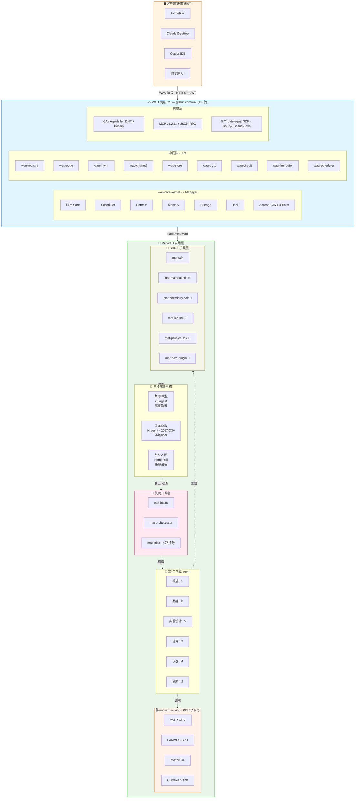
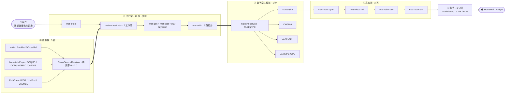

# MatWAU

> 一个跑在 WAU 网络 OS 之上的多学科科研超级智能体 —— 用一个 HTTP API 跑通 **材料 / 化学 / 生物 / 物理 / 医药 / 半导体 / 能源** 全学科"查数据 → 出方案 → 算模拟 → 控仪器 → 写报告"的完整科研闭环。

[English](README.md) | [中文](README.zh-CN.md)

[](LICENSE)
[](https://www.python.org)
[](tests/)
[](https://github.com/wau)
[](RELEASE_NOTES_v1.1-Academic.md)

## 为什么需要 MatWAU?

任何一个学科的科研工作流,都是这五步:**读文献 → 选体系 → 算模拟 → 做实验 → 写报告**。每一步都慢、都贵、都因人而异。

**MatWAU** 把这五步封装成 **23 个内置 agent + 灵魂 3 件套**(理解 → 调度 → 评估),只对外暴露 **一个 HTTP 端点**。它跑在 **WAU 网络 OS** 上,前端可以是 HomeRail / Claude Desktop / Cursor / 自家 UI,**MatWAU 自己不做 UI** —— 这让它**几天上线,而不是几个月**。

- **多学科通用** — v1.x 以材料学院为首发垂直,`mat-sdk` 让任意实验室在 **几周内**(而不是几个季度)fork 出新学科(化学 / 生物 / 物理 / 医药 / 半导体)子 agent
- **真实验,不是 demo** — `mat-robot-*` agent 驱动 Bruker XRD / Netzsch DSC / 合成机器人;`mat-sim-service` 在真 GPU 上跑 MatterSim / CHGNet / VASP-GPU
- **决策可追溯** — `mat-data-lineage` 用 append-only + 哈希链记录每一步,可端到端重放
- **Apache 2.0 + 100% 本地化** — 代码开源,数据留在本机,无云锁死

## 核心特性

- **23 个内置 agent** — 5 个编排 + 8 个数据客户端(arXiv / Materials Project / OQMD / COD / NOMAD / JARVIS / PubChem / CrossRef)+ 5 个实验设计 + 3 个计算 + 4 个仪器驱动 + 2 个辅助
- **灵魂 3 件套** — `mat-intent` 解析自然语言,`mat-orchestrator` 跑 DAG 工作流,`mat-critic` 沿 5 路独立打分(物理一致性 / 合成可行性 / 安全规则 / 跨机器人 / 跨源数据)
- **无头后端** — 只暴露 1 个 `POST /wau/dispatch` 端点,**0 行 UI 代码**
- **跨源共识** — `CanonicalKey = (reduced_formula, Pearson_symbol, spacegroup_number)` 主键对齐异构数据库,共识率从 0 → 1.0
- **数字孪生模拟** — `mat-sim-service` Rust/gRPC 子服务跑 VASP-GPU / LAMMPS-GPU / MatterSim / CHGNet
- **多学科 SDK** — `mat-sdk` + `MatSubAgent` ABC + `install_into_matwau()`,1 行 `pip install` 即可扩展新学科
- **决策可审计追溯** — `mat-data-lineage` 写 append-only 记录(符合 FAIR 原则),任何决策可重放
- **4 档报告风格** — 本科生 / 研究生 / 工程师 / 教授;Markdown / LaTeX / PDF 三种格式

## 架构



### 4 步全闭环("贾维斯"承诺)



## 多学科覆盖矩阵

| 学科 | SDK | 状态 | 数据源 | 模拟工具 |
|---|---|---|---|---|
| **材料科学**(首发) | `mat-material-sdk` | ✅ v1.4.4 GA | OQMD / COD / NOMAD / JARVIS / MP / arXiv | VASP / LAMMPS / MatterSim / CHGNet |
| **化学** | `mat-chemistry-sdk` | 📅 Phase 0(2026 Q4) | PubChem / ChemSpider / CrossRef | DFT / RDKit |
| **生物** | `mat-bio-sdk` | 📅 Phase 1(2027 Q1) | PDB / UniProt / ChEMBL / PubMed | AlphaFold / MD |
| **物理** | `mat-physics-sdk` | 📅 Phase 1(2027 Q1) | INSPIRE-HEP / arXiv physics | Gaussian / QMC |
| **医药 / 制药** | `mat-pharma-sdk` | 🤝 合作伙伴计划 | ClinicalTrials / DrugBank / FAERS | ADMET / PK/PD |
| **半导体** | `mat-semi-sdk` | 🤝 合作伙伴计划 | Materials Cloud / AFLOW | TCAD / Sentaurus |
| **能源 / 电池** | `mat-energy-sdk` | 🤝 合作伙伴计划 | MP battery subset + 实验库 | CALPHAD / 循环模拟 |

所有 SDK 共用同一个 `MatSubAgent` ABC —— 写 1 个类,即可发布新学科。

## 安装

```bash
# 1. clone
git clone https://github.com/XploreAlpha/matwau.git
cd matwau

# 2. 装依赖
pip install -r requirements.txt

# 3. (推荐)装 mat-sdk 以便扩展学科
pip install -e ./sdk
```

环境要求:**Python 3.11+**。`mat-sim-service` Rust 子服务需单独 build(`mat_sim_service/` 下 `cargo build --release`),不用 GPU 算力时可不装。

## 快速上手

### 1. 跑 canonical 演示(mock 模式,无需 GPU / 无需外部 SDK)

```bash
python3 examples/multi_experiment_demo.py
# 期望输出:3 实验并行 + L4 复核 + BatchWorkflowResult
```

### 2. 调 HTTP API

```bash
curl -X POST http://localhost:8080/wau/dispatch \
  -H "Authorization: Bearer $TOKEN" \
  -H "Content-Type: application/json" \
  -d '{
    "intent": "介绍阿司匹林",
    "user_id": "alice@university.edu",
    "tenant_id": "academic-2026"
  }'
```

响应(纯 JSON,无 HTML):

```json
{
  "widgets": [
    {
      "type": "matwau_markdown",
      "data": { "markdown": "...", "title": "..." },
      "fallback_text": "..."
    }
  ],
  "duration": 71.0,
  "success": true
}
```

### 3. 启用真 LLM(可选)

```bash
export MATWAU_LLM_ENABLED=1
export MATWAU_LLM_API_KEY="<your-key>"
export MATWAU_LLM_BASE_URL="https://api.deepseek.com"
export MATWAU_LLM_MODEL="deepseek-v4-flash"
```

v1.4.4-Academic 端到端已验证 —— 输入"介绍阿司匹林",`widgets[0].data.markdown` 返回 **1133 字**真 DeepSeek 输出。

### 4. 写你自己的 agent(3 行 Python)

```python
from matwau.core.agent_base import MatWAUAgentBase, AgentRequest, AgentResponse

class MyDomainAgent(MatWAUAgentBase):
    name = "my-domain-agent"

    def system_prompt(self) -> str:
        return "你是某学科专家,..."

    def act(self, ctx, tools):
        return AgentResponse(reply="ok", artifacts={}, confidence=0.9, cost=0.1)

agent = MyDomainAgent()
req = AgentRequest(run_id="run-001", message="...", artifacts={}, context={})
print(agent.run(req).reply)
```

## 部署

### 单机 Docker Compose(推荐用于评估)

```bash
cd deploy/academic
docker compose build --no-cache
docker compose up -d
sleep 10
curl -s http://localhost:8080/version | jq -r '.version'
# 期望:v1.4.2-Academic  (镜像 ID 才是真证据)
```

### 生产环境(独立服务器)

```bash
# 1. 准备:Python 3.11+,Docker 24+,可选 NVIDIA 驱动 + CUDA 12.x
# 2. clone & 配置
git clone https://github.com/XploreAlpha/matwau.git /opt/matwau
cd /opt/matwau
cp deploy/academic/.env.example deploy/academic/.env
# 编辑 .env 设置 MATWAU_LLM_API_KEY 等

# 3. build & 启动
cd deploy/academic
docker compose build --no-cache
docker compose up -d

# 4. 验证
curl -s http://localhost:8080/health
docker images matwau/academic:v1.4.2-Academic --format "{{.ID}}\t{{.CreatedAt}}"
```

### Kubernetes(规划 v1.3.0)

Helm chart 与 Operator 计划在 v1.3.0 发布;现阶段以 Docker Compose 作为生产部署方式。

### 硬件配置建议

| 场景 | CPU | 内存 | GPU | 备注 |
|---|---|---|---|---|
| **评估 / 开发** | 4 核 | 8 GB | — | mock 模式 |
| **学院单实验室** | 8 核 | 32 GB | — | 调外部 LLM API,无 DFT |
| **生产 + MLIP** | 16+ 核 | 64+ GB | 1× A100 / H100 | 启用 `mat-sim-service` |
| **多实验室 / 企业** | 32+ 核 | 128+ GB | 2× A100 + SLURM | 多租户 |

## API 参考

唯一对外端点:

```
POST /wau/dispatch
Headers: Authorization: Bearer <JWT-HS256 含 4 claim>
Body:    { intent, user_id, tenant_id, metadata? }
Returns: { widgets[], duration, success }
```

其他端点:

| 端点 | 用途 |
|---|---|
| `GET /version` | 构建版本 + 镜像 ID |
| `GET /health` | 存活 / 就绪检查 |
| `GET /agents` | 列出已注册 agent(子 agent + 23 内置) |
| `POST /agents/install` | 热安装社区子 agent(Phase 1+) |
| `GET /lineage/{run_id}` | 某次运行的 append-only 决策追溯链 |

## 文档

| 文档 | 用途 |
|---|---|
| [CHANGELOG.md](CHANGELOG.md) | 版本化发布历史 |
| [RELEASE_NOTES_v1.1-Academic.md](RELEASE_NOTES_v1.1-Academic.md) | v1.1-Academic 发布说明 |
| [PATCH_NOTES_v1.1.1-Academic.md](PATCH_NOTES_v1.1.1-Academic.md) | v1.1.1 patch 说明 |
| [docs/donation_proposal.md](docs/donation_proposal.md) | 详细项目说明(中文长文) |
| [docs/user-manual.md](docs/user-manual.md) | 用户手册 |
| [docs/deploy.md](docs/deploy.md) | 详细部署指南 |
| [LICENSE](LICENSE) | Apache 2.0 许可证 |

## 版本策略

当前版本:**v1.4.4-Academic**(v1.4.x patch 序列 — 所有 patch 共享 `matwau/academic:v1.4.2-Academic` 镜像 tag;**镜像 ID 才是真证据**,而不是 version 字符串)。

MatWAU 遵循 [SemVer 2.0.0](https://semver.org/)。公共 API 自 v1.0.0 起稳定;breaking change 只在 MAJOR 升级时出现;废弃 API 至少保留 1 个 minor 版本并附迁移提示。

v2.0 路线图(2027 Q3)目标:贾维斯全闭环、多学科 SDK GA、`mat-sim-service` 生产化。

## 贡献

欢迎贡献 —— 新子 agent、新数据插件、新 benchmark query、新学科 SDK。请在重大 PR 前先开 issue。

项目遵循 WAU 19 仓 lockstep 版本策略(SDK / kernel 升级时同步);`sdk/examples/` 下的社区子 agent 走自己的节奏。

## 许可证

[Apache License 2.0](LICENSE) — 可商用、可学术,需保留版权声明。

Copyright © 2026 XploreAlpha.
