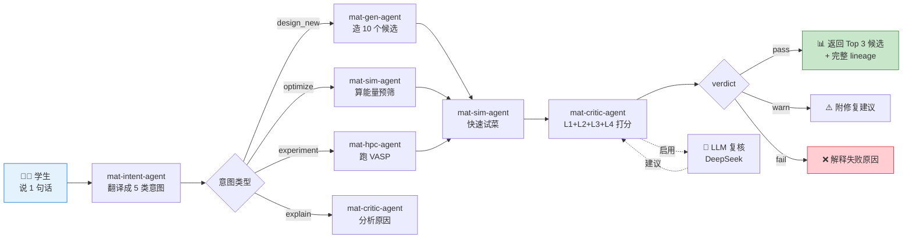

# MatWAU 学院版 — 招生宣传样板(academic_pitch)

> **目的**: 1 分钟看懂 MatWAU 学院版是什么、能给学院带来什么、怎么承诺。
> **受众**: 学院招生办 / 学科评估 / 对外接待 / 院长
> **格式**: 单文件 Markdown(Mermaid 流程图,GitHub / 学院 GitLab 原生渲染)
> **配套版本**: MatWAU v1.0-Academic
> **License**: Apache 2.0

---

## §1. 标题 + 一句话定位

<div align="center">

# 🎓 MatWAU 学院版

### 材料科学 AI 实验室小工坊

**主署名**:`XploreAlpha`(开发 / 维护)· **子署名**:`[母校]`(学术部署)| **License**: Apache 2.0

</div>

> **一句话定位**: 一个由 XploreAlpha 校友团队捐赠给母校的、覆盖 17 个 AI agent 的材料科学实验室工具集,Apache 2.0 永久免费,数据归学校,XploreAlpha 长期维护。

---

## §2. 海报(1 页纸排版)

```
┌──────────────────────────────────────────────────────────┐
│                                                          │
│            🎓 MatWAU 学院版                              │
│            材料科学 AI 实验室小工坊                       │
│                                                          │
│       XploreAlpha(主署名)· [母校](子署名)· Apache 2.0    │
│                                                          │
├──────────────────────────────────────────────────────────┤
│                                                          │
│  ⚛️ 17 个 AI agent          🤖 Stage 3 JARVIS 雏形      │
│     mat-gen/sim/exp/critic     从会跑到可观测            │
│     + 4 机器人 SDK mock        到可解释(LLM 复核可选)  │
│                                                          │
│  🧪 3 大材料域              📚 8 周实验课程             │
│     金属合金 / 聚合物 / 陶瓷    本科生 4 小时看懂        │
│                                2 天跑通                 │
│                                                          │
├──────────────────────────────────────────────────────────┤
│                                                          │
│  数字:1,298 个测试通过 · 35 周研发 · 1 套完整工具集     │
│                                                          │
│  承诺:数据归学校 · Apache 2.0 · 永久免费 · 长期维护     │
│                                                          │
│  v1.0-Academic · 2026-07-26                              │
│                                                          │
└──────────────────────────────────────────────────────────┘
```

---

## §3. 4 大能力

### ⚛️ 能力 1 — 17 个 AI agent(覆盖材料科学全栈)

```
造物主 mat-gen-agent         晶体结构生成(3 材料域)
试菜员 mat-sim-agent         MLIP 快速预筛(CHGNet mock)
超算员 mat-hpc-agent         VASP + Slurm 对接
实验师 mat-exp-agent         XRD Bragg 解谱 + DSC 分类
翻译官 mat-intent-agent      5 类意图 + 11 material_system
调度器 mat-orchestrator      DAG + 多实验并行(Stage 3 雏形)
裁决者 mat-critic-agent      L1 物理 + L2 合成 + L3 安全 + L4 跨机器人
                           + 可选 LLM 二次复核(DeepSeek)
主动学 mat-bayesian         GP + TPE + EI/UCB/PI 3 acquisition
成本官 mat-cost              工作流预算守卫
记录员 mat-data-lineage     Postgres + SQLite 自动接线
图书管 mat-lit              arXiv API + RAG
化学师 mat-chemist-agent    多机器人协调
+ 4 机器人 SDK mock         OT-2 / Bruker XRD / Zeiss SEM / TA Trios DSC
+ MaterialDomainRouter      3 材料域路由
```

### 🧪 能力 2 — 3 大材料域

| 域 | 典型材料 | 默认演示 |
|---|---|---|
| **金属合金** | Inconel 718 / Ti-6Al-4V / SS304 | 4 步全跑(synth + xrd + em + dsc) |
| **聚合物** | PMMA / PE / PS | 2 步快测(synth + dsc) |
| **陶瓷** | TiO2 / Al2O3 / BaTiO3 | 3 步标准(synth + xrd + dsc) |

### 🤖 能力 3 — Stage 3 JARVIS 雏形

Stage 3 = "从会跑到可观测到可解释":

```
阶段 1: 会跑    (W19-W22 4 机器人 mock SDK 全跑通)
阶段 2: 可观测  (W30-W32 critic L4 + lineage + 多实验并行)
阶段 3: 可解释  (W33 LLM 二次复核 — 规则 + LLM 双层解释)
```

### 📚 能力 4 — 8 周实验课程(配合 17 agent)

| 周 | 主题 | 演示 |
|---|---|---|
| W1 | 入门 + 单 agent | mat-intent-agent |
| W2 | 模拟 + 实验 | mat-sim + mat-exp |
| W3 | 主动学习 | mat-bayesian |
| W4 | 裁决与安全 | mat-critic L1-L4 |
| W5 | 多实验编排 | mat-orchestrator |
| W6 | 血缘与可观测 | mat-data-lineage |
| W7 | LLM 二次复核 | mat-critic + DeepSeek |
| W8 | 期末项目 | 自选 5 方向 |

---

## §4. 流程图(Mermaid 2 个图)

### 4.1 学生视角(从用户输入到结果)



### 4.2 学院视角(数据归属 + 维护承诺)

```mermaid
flowchart TB
    subgraph 学生层["👨‍🎓 学生 / 老师"]
        A["命令行 / HTTP API"]
    end

    subgraph 学院服务器层["🏛️ 学院自有 / 指定服务器"]
        B["matwau-app<br/>Python 3.11 Docker"]
        C[("Postgres 16<br/>Lineage 数据)"]
        D[("学院 IT 备份<br/>matwau-data + matwau-db)"]
    end

    subgraph 第三方层["🌐 可选外部"]
        E["DeepSeek API<br/>LLM 复核"]
    end

    A -->|HTTP :8080| B
    B -->|TCP 5432| C
    C --> D
    B -.MATWAU_LLM_API_KEY<br/>学院 IT 配.-> E
    E -.自然语言<br/>复核建议.-> B

    style 学生层 fill:#fff3e0
    style 学院服务器层 fill:#e8f5e9
    style 第三方层 fill:#fce4ec
    style D fill:#c8e6c9,stroke:#2e7d32
```

---

## §5. 对比表(学院版 vs 3 种参照)

| 维度 | **学院版 MatWAU** | 海外类似项目 | 商业版 | 实验室手工 |
|---|---|---|---|---|
| **成本** | 免费(Apache 2.0)| $50k+/年授权 | $500k+/年 | 不可估(教授时间) |
| **数据归属** | **学校**(完全自主)| 海外机构 | 商业公司 | 学校(但不可复现) |
| **可定制 / Fork** | ✅ 自由 | ❌ 闭源 | ❌ 闭源 | ✅ 自由但慢 |
| **AI agent 数** | **17** + Stage 3 雏形 | 通常 1-3 | 5-10(闭源)| 0 |
| **3 大材料域** | ✅ 全覆盖 | 部分 | 部分 | 不固定 |
| **教学配套** | **8 周教学手册** | 论文 1-2 篇 | 商业培训 | 无 |
| **部署方式** | 学院自有服务器 | 海外云端 | 商业云端 | 无系统 |
| **可复现 / 审计** | **LineageStore 自动接线** | 部分 | 部分 | 不可复现 |
| **真仪器接入** | 路线图(W37.7)| 部分 | 商业 SDK | 手工 |
| **长期维护** | **XploreAlpha LTS 18 个月** | 看项目方 | 商业 SLA | 教授退休 |
| **License** | **Apache 2.0** | 看项目方 | 商业 | 无 |
| **LLM 复核可选** | ✅ DeepSeek + fail-soft | 部分 | 商业 LLM | 无 |

**学院版 4 大不可替代点**:
1. ✅ **永久免费 + 永久授权**(Apache 2.0)
2. ✅ **数据归学校**(不离开学院服务器)
3. ✅ **17 个 agent 覆盖全栈**(海外通常 1-3 个)
4. ✅ **8 周教学手册配套**(海外通常只发论文)

---

## §6. 1 分钟宣讲脚本(60s 分镜)

> 用途:招生办 / 老师 / 院长在 1 分钟内说清楚 MatWAU 学院版价值

### [0:00-0:10] 钩子(10 秒)

> "想象一下:学生说一句'帮我造 1 个新材料',1 套 AI 帮他做完 — 构思、模拟、表征、复核、写报告。这就是 MatWAU 学院版。"

### [0:10-0:30] 3 件价值(20 秒)

> "对学院有 **3 件价值**:
>
> 🎓 **教学** — 8 周实验课,本科生 4 小时看懂,2 天跑通
>
> 🔬 **科研** — 17 个 AI agent 覆盖金属 / 聚合物 / 陶瓷 3 大材料域
>
> 🏭 **示范** — Stage 3 JARVIS 雏形,从会跑到可观测到可解释"

### [0:30-0:50] 4 件承诺(20 秒)

> "**4 件承诺**:
>
> 1️⃣ **Apache 2.0** 永久免费、永久授权
>
> 2️⃣ **双署名** — XploreAlpha(开发)+ [母校](学术)
>
> 3️⃣ **数据归学校**,完全自主,不离开学院服务器
>
> 4️⃣ **XploreAlpha 团队长期维护**(LTS 18 个月起)"

### [0:50-1:00] 收尾 + CTA(10 秒)

> "我们已经在 GitHub 开源,XploreAlpha 捐赠给母校。想体验?扫码加群 / 访问 docs/MatWAU/。"

---

## §7. 4 件承诺(展开版)

| # | 承诺 | 具体 |
|---|---|---|
| 1 | **Apache 2.0** | 永久免费、永久授权、可商用、可 fork、可改、可重新分发 — 学院 IT 完全自主 |
| 2 | **双署名** | `XploreAlpha`(开发 / 维护,首位)+ `[母校]`(学术部署,可挂子名称) |
| 3 | **数据归学校** | 所有 lineage / 实验数据 / 用户数据 → 学院 IT 管理的 volume;MatWAU 服务不收集不触碰 |
| 4 | **长期维护** | XploreAlpha 团队承诺 LTS 18 个月(学院版 v1.0-Academic 起);4 级 SLA(P0 24h 首次响应);Apache 2.0 允许学院独立 fork 继续演进 |

---

## §8. 数字清单(招生办最爱)

```
17     个 AI agent(mat-gen/sim/hpc/exp/intent/orchestrator/critic/bayesian/
                 cost/lineage/lit + chemist + 4 robot + domain router)
3      大材料域(金属合金 / 聚合物 / 陶瓷)
1,298  个测试通过(全量 pytest,~3 分钟)
8      周实验课程(配套 W37.2 教学手册)
35     周研发周期(2026-07-24 → 2026-07-26)
2      个开源 doc 子目录(docs/teaching_manual/ + docs/outreach/)
4      级 SLA 维护承诺(P0 致命 / P1 严重 / P2 一般 / P3 建议)
0      行 UI 代码(纯无头后端)
1      个本地 tag(v1.0-Academic,GitHub 可查)
4      大法律声明(捐赠 / 数据 / 部署 / 维护)
∞      年 Apache 2.0 授权(永久)
```

---

## §9. CTA(行动号召)

| 渠道 | 链接 |
|---|---|
| **GitHub** | https://github.com/XploreAlpha/matwau |
| **学院版 release notes** | https://github.com/XploreAlpha/matwau/releases/tag/v1.0-Academic |
| **教学手册入口** | [docs/teaching_manual/README.md](../teaching_manual/README.md) |
| **学院 IT 部署文档** | [docs/deploy_academic.md](../deploy_academic.md) |
| **捐赠项目说明书** | [docs/donation_proposal.md](../donation_proposal.md) |
| **GitHub Issues** | https://github.com/XploreAlpha/matwau/issues |
| **邮件** | support@xplorealpha.example |

---

## §10. 鸣谢

```
35 周研发:2026-07-24 → 2026-07-26
W1-W33:17 agent + 1298 测试 + Stage 3 雏形
W34:真 OT-2 硬件(已 RESERVED)
W35:Stripe 商业化(已暂缓,学院版优先)
W36:产学研路线图(候选)
W37:学院版系列(本次)— W37.0 法律 + W37.2 教学 + W37.3 release + W37.4 docker + W37.5 宣传
```

---

**end of academic_pitch.md**

> 编写日期:2026-07-26
> 配套版本:MatWAU v1.0-Academic
> License:Apache 2.0
> 维护:XploreAlpha 团队
> 受众:学院招生办 / 学科评估 / 对外接待 / 院长

---

### 附:本文件可被以下场景复用

| 场景 | 使用章节 |
|---|---|
| 招生宣讲 PPT 首页 | §2 海报 + §8 数字清单 |
| 学科评估展示 | §3 4 大能力 + §4 流程图 + §5 对比表 |
| 对外接待讲 1 分钟 | §6 1 分钟脚本 |
| 给院长写决策书 | §7 4 件承诺 + §5 对比表 |
| 给 IT 写需求文档 | §4.2 学院视角流程图 + §8 数字清单 |