# MatWAU 学院版 — 8 周课堂 PPT(slides_8week)

> **用途**: 老师讲课用的讲义(学生打印成 8 周讲义)
> **格式**: 单文件 Markdown(用 `---` 分隔每张"PPT 页")
> **配套**: 教学手册 [README.md](./README.md) + [02_8week_curriculum.md](./02_8week_curriculum.md) + 评分 [04_grading_rubric.md](./04_grading_rubric.md)
> **时长**: 8 周 × 3 学时/周 × 1 学时讲 + 2 学时上机
> **License**: Apache 2.0(同 MatWAU)

> **使用建议**:
> - 老师用 VSCode / Typora / Marp / Slidev 打开,直接投影
> - 学生用浏览器打开 GitHub 仓 `docs/teaching_manual/slides_8week.md`,Mermaid 图自动渲染
> - 每张"PPT 页"对应 5-10 分钟讲解 + 5-10 分钟讨论

---

# W1 — 入门 + 单 agent(mat-intent-agent)

---

## 📍 W1-1: 课程导入

**MatWAU 学院版 — 8 周课程**
**W1 — 入门 + 单 agent**
**主讲: [老师姓名] · 2026-XX-XX**

> 🎯 **本课目标**:
> 1. 理解"agent"是什么 — 与普通函数的区别
> 2. 跑通 1 个 agent:`mat-intent-agent`(翻译官)
> 3. 写出第 1 个自己的 MatWAU agent

> 📚 **配套资料**:
> - 教学手册:[01_overview.md](./01_overview.md)
> - Demo 脚本:[03_demo_scripts/W1_intent_classification.py](./03_demo_scripts/W1_intent_classification.py)

---

## 📍 W1-2: 8 周全景

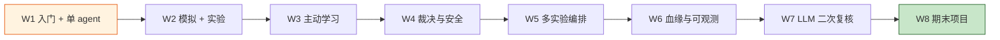

> 💡 **本学期节奏**:
> - W1-W4:**单 agent 深度**(每周 1 个)
> - W5-W7:**多 agent 协作**(编排 / 血缘 / LLM)
> - W8:**期末项目**(自选 5 方向)

---

## 📍 W1-3: 什么是 agent?

### 普通函数 vs Agent

| 维度 | 普通函数 | Agent |
|---|---|---|
| **输入** | 参数 | 自然语言 + 上下文 |
| **处理** | 确定性算法 | 思考 → 用工具 → 检查 → 输出 |
| **输出** | 返回值 | 自然语言 + 结构化 artifact |
| **可解释** | 难 | 容易(自带 reasoning)|

### MatWAU agent 的"inner loop 4 步"

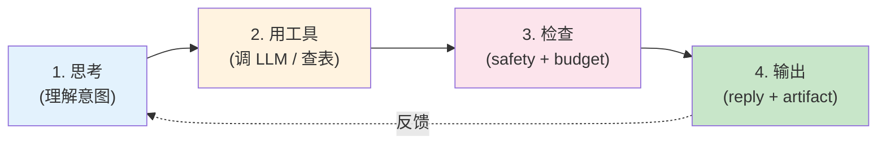

---

## 📍 W1-4: 17 个 agent 总览

| # | Agent | 一句话 | 演示 |
|---|---|---|---|
| 1 | **mat-intent** | 翻译官(5 类意图)| W1 |
| 2 | **mat-gen** | 造物主(晶体生成)| W2 |
| 3 | **mat-sim** | 试菜员(MLIP)| W2 |
| 4 | **mat-hpc** | 超算员(VASP)| W5 |
| 5 | **mat-exp** | 实验老师(XRD)| W2 |
| 6 | **mat-critic** | 裁决者(L1-L4)| W4 |
| 7 | **mat-bayesian** | 主动学习(TPE)| W3 |
| 8 | **mat-cost** | 成本守门员 | W5 |
| 9 | **mat-data-lineage** | 记录员 | W6 |
| 10 | **mat-lit** | 图书管理员 | W5 |
| 11 | **mat-chemist** | 多机器人协调 | W5 |
| 12-15 | **4 robot SDK** | OT-2/XRD/SEM/DSC mock | W5 |
| 16 | **orchestrator** | 调度器(DAG)| W5 |
| 17 | **domain router** | 3 材料域路由 | W2 |

---

## 📍 W1-5: mat-intent-agent 演示

> **Demo 脚本**:`docs/teaching_manual/03_demo_scripts/W1_intent_classification.py`
> **老师操作**:
> 1. 打开终端
> 2. `cd /opt/matwau`
> 3. `python3 docs/teaching_manual/03_demo_scripts/W1_intent_classification.py`

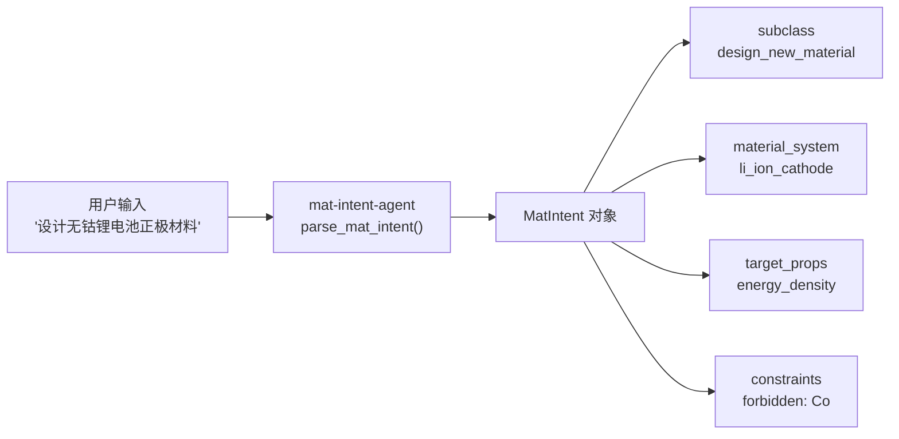

> 🎓 **演示输出**(预期):
> - `subclass: design_new_material`
> - `material_system: li_ion_cathode`
> - `target_props: ['energy_density']`
> - `constraints: {forbidden: ['Co']}`

---

## 📍 W1-6: 课堂互动

### 提问 1(2 分钟)
> "如果你说一句话给 MatWAU,最希望它先做什么?"
> - A. 听懂你的意图
> - B. 立刻给你答案
> - C. 反问你确认
> - D. 帮你查资料

**答案:A**(mat-intent 就是干这个的)

### 提问 2(3 分钟)
> "mat-intent-agent 怎么处理歧义?"
> - 关键词匹配(`设计 / 优化 / 综述 / 实验`)
> - 上下文理解(从 `forbidden / no / no_xxx` 提取约束)
> - 5 类意图分类 + 11 material_system + 8 target_props

### 提问 3(5 分钟)
> **现场改 prompt 演示**(老师现场改 `system_prompt()`,让学生看输出变化)

---

## 📍 W1-7: 上机任务 + 课外作业

### 上机(2 学时,90 分钟)

```bash
# 1. 跑 demo(5 分钟)
python3 docs/teaching_manual/03_demo_scripts/W1_intent_classification.py

# 2. 改 prompt(20 分钟)
# 打开 agents/mat_intent_agent/mat_intent_agent.py
# 改 system_prompt() 第 87 行(加约束)
# 看输出变化

# 3. 写 HelloAgent(40 分钟)
# 见 01_overview.md §4 Step 4 模板

# 4. 写陶瓷百科 agent(25 分钟)
# 仿 HelloAgent,做 1 个"陶瓷百科"
```

### 课外作业(3 小时)
1. **跑通 3 类意图**(20 分):`design_new_material` / `optimize_existing` / `literature_review`
2. **改 prompt 实验**(30 分):把系统提示改成"只回答金属问题",看 intent 分类变化
3. **写陶瓷百科 agent**(50 分):模仿 `HelloMatWAUAgent`,实现"陶瓷百科"

> 📅 **下节课(W2)**:模拟 + 实验(mat-sim-agent + mat-exp-agent),MLIP + XRD 布拉格定律

---

# W2 — 模拟 + 实验(mat-sim + mat-exp)

---

## 📍 W2-1: 上节回顾 + 本节目标

> ✅ **W1 回顾**:
> - 理解了 agent 与函数的区别
> - 跑通了 mat-intent-agent
> - 写了第 1 个 HelloAgent

> 🎯 **W2 目标**:
> 1. 理解"MLIP 预筛 + 真实验验证"科研范式
> 2. 跑通 mat-sim-agent(快速试菜)
> 3. 跑通 mat-exp-agent(读 XRD 数据)
> 4. 理解布拉格定律 `2d sinθ = nλ`

---

## 📍 W2-2: 材料表征实验流程

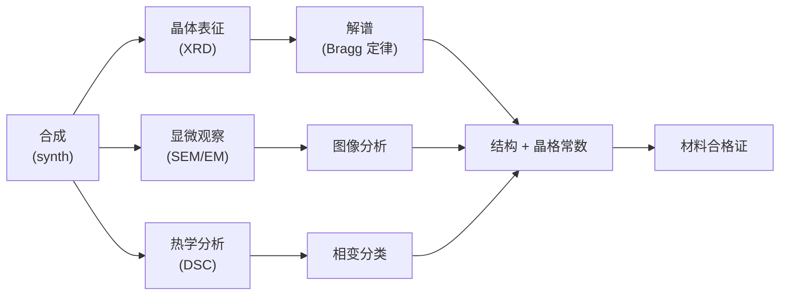

> 💡 **科研范式**:**合成 → 多表征 → 数据解谱 → 综合结论**

---

## 📍 W2-3: mat-sim-agent(快速试菜员)

### MLIP(Machine Learning Interatomic Potential)原理

| 传统 DFT | MLIP |
|---|---|
| 量子力学计算 | 机器学习拟合 |
| 单点 ~ 数小时 | 单点 ~ 数秒 |
| 精度高 | 精度接近 DFT(95%+)|
| 适合小体系 | 适合大体系 / 预筛 |

### mat-sim-agent 能力

```python
# 1 个 SimCandidate 含:
{
    "formula": "LiCoO2",
    "cif": "data_LiCoO2\n...",       # 晶体结构
    "relaxed_energy": -3.5,           # eV/atom(弛豫后能量)
    "forces_max": 0.01,               # eV/Å(最大残余力)
    "relaxation_converged": True,     # 是否收敛
    "stability": "stable",            # stable / metastable / unstable
    "confidence": 0.92,               # 置信度
}
```

---

## 📍 W2-4: mat-exp-agent(实验老师 — XRD 解谱)

### 布拉格定律

```
2d sinθ = nλ
│   │     │  │
│   │     │  └─ 波长(Cu Kα = 1.5406 Å, Mo Kα = 0.7107 Å)
│   │     └─ 衍射级数(n = 1, 2, 3 ...)
│   └─ 半衍射角(θ)
└─ 晶面间距 d(Å)

→ 已知 λ + 测得 θ → 求 d
→ 多个 d → 反推晶格常数 a, b, c + 晶系
```

### XRD 谱演示

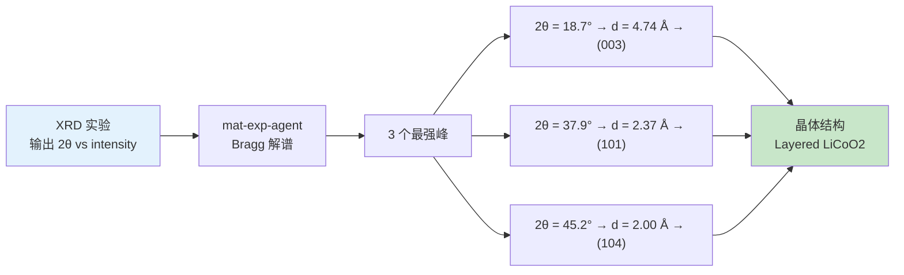

---

## 📍 W2-5: Demo 演示指引

> **Demo 脚本**:`docs/teaching_manual/03_demo_scripts/W2_xrd_peak_decode.py`

### Step 1: mat-sim-agent 跑 3 个候选

```bash
python3 docs/teaching_manual/03_demo_scripts/W2_xrd_peak_decode.py
```

**预期输出**:
```
LiCoO2    E = -3.50 eV/atom  stable       (最优)
LiNiO2    E = -3.20 eV/atom  stable
LiMnO2    E = -2.90 eV/atom  metastable   (略差)
```

### Step 2: mat-exp-agent 解 XRD 谱

**预期输出**(5 个最强峰):
```
2θ = 18.7° → d = 4.74 Å → (003)
2θ = 37.9° → d = 2.37 Å → (101)
2θ = 45.2° → d = 2.00 Å → (104)
2θ = 59.5° → d = 1.55 Å → (107)
2θ = 65.6° → d = 1.42 Å → (018)
```

> 🎓 **可现场改**:`target_wavelength` 从 1.5406(Cu Kα)→ 0.7107(Mo Kα),峰位置会向高角度移动

---

## 📍 W2-6: 课堂互动

### 提问 1(2 分钟)
> "为什么需要 MLIP 预筛 + DFT 精修?"
> - MLIP:**快速**(秒级)+ **粗筛**(1000 个候选)
> - DFT:**慢**(小时级)+ **精修**(10 个候选)
> - 配合用 = 性价比最高

### 提问 2(3 分钟)
> "XRD 峰从 Cu Kα 改 Mo Kα,2θ 怎么变?"
> - λ 减小 → sinθ 增大 → θ 增大 → 2θ 增大
> - **峰位向高角度移动**

### 提问 3(5 分钟)
> **现场改 wavelength**:老师现场改 `xrd_data["wavelength_A"]`,让学生看峰位移

---

## 📍 W2-7: 上机任务 + 课外作业

### 上机(2 学时,90 分钟)

```bash
# 1. 跑 demo(5 分钟)
python3 docs/teaching_manual/03_demo_scripts/W2_xrd_peak_decode.py

# 2. 改 wavelength(20 分钟)
# 把 1.5406 → 0.7107(Mo Kα)
# 看峰位移

# 3. 写 XRD 解谱脚本(40 分钟)
# 输入:2θ 数组
# 输出:晶格常数
# 用 Bragg 定律: d = λ / (2 sinθ)

# 4. 跑 mat-sim 排序(25 分钟)
# 给 3 个不同结构,看能量排序
```

### 课外作业(4 小时)
1. **写 XRD 解谱脚本**(40 分):输入 2θ → 输出 d-spacing
2. **改 wavelength 实验报告**(30 分):从 Cu Kα → Mo Kα,解释峰位移原理(布拉格定律)
3. **mat-sim 排序**(30 分):跑 3 个候选,写排序 + 解释

> 📅 **下节课(W3)**:主动学习(mat-bayesian),GP + TPE + 3 acquisition

---

# W3 — 主动学习(mat-bayesian)

---

## 📍 W3-1: 上节回顾 + 本节目标

> ✅ **W2 回顾**:
> - mat-sim-agent 跑通 MLIP 预筛
> - mat-exp-agent 跑通 XRD 解谱
> - 理解了布拉格定律

> 🎯 **W3 目标**:
> 1. 理解"主动学习"思想:用最少实验找最优
> 2. 跑通 GP + TPE
> 3. 比较 3 种 acquisition:EI / UCB / PI

---

## 📍 W3-2: 主动学习 vs 网格 vs 随机

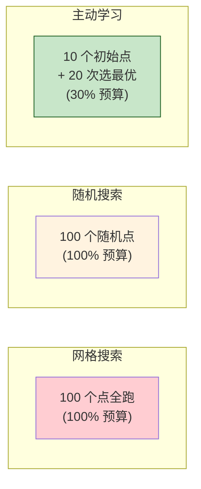

> 💡 **核心思想**:不要均匀探索,而是**优先选"信息量大"的点**(acquisition function 决定)

---

## 📍 W3-3: GP + TPE 数学直觉

### Gaussian Process(GP)
- 把"未知函数"看作一个**高斯分布**
- 已知点 → 预测未知点的均值 + 标准差
- **直觉**:靠近已知点 → 均值收敛;远离已知点 → 标准差大

### TPE(Tree-structured Parzen Estimator)
- 不直接建模 f(x),而是建模 p(good) 和 p(bad)
- 用密度估计选"高 good 概率 + 低 bad 概率"的点
- **直觉**:把好样本和坏样本分开估计,选边界附近的点

---

## 📍 W3-4: 3 种 Acquisition 对比

| 缩写 | 全称 | 性格 | 适用场景 |
|---|---|---|---|
| **EI** | Expected Improvement | 平衡 | **通用首选** |
| **UCB** | Upper Confidence Bound | 激进 | 探索未知区域 |
| **PI** | Probability of Improvement | 保守 | 已知最优附近精修 |

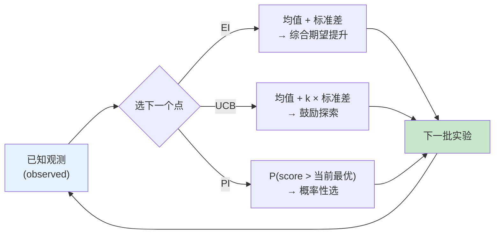

---

## 📍 W3-5: Demo 演示指引

> **Demo 脚本**:`docs/teaching_manual/03_demo_scripts/W3_bayesian_optimize.py`

### Step 1: 跑 3 种 acquisition(10 trials)

```bash
python3 docs/teaching_manual/03_demo_scripts/W3_bayesian_optimize.py
```

**预期输出**(数值越高越好):
```
EI:  best = 0.234
UCB: best = 0.198
PI:  best = 0.267    ← 略优
```

### Step 2: 改 n_trials 看收敛

```python
# 在 demo 里改 n_trials = 20 / 50
# 看 3 种 acquisition 的收敛曲线
```

---

## 📍 W3-6: 课堂互动 + 课外作业

### 提问 1(2 分钟)
> "为什么要主动学习,不用穷举?"
> - 真实实验:**每次实验 1 小时 + ¥5000**,预算有限
> - 主动学习:**用 30% 预算达 95% 性能**

### 提问 2(3 分钟)
> "EI / UCB / PI 哪个适合你的研究?"
> - **EI**:不知道选啥就用 EI
> - **UCB**:新材料探索(鼓励大胆)
> - **PI**:成熟配方微调(精修)

### 上机 + 作业

**上机(90 分钟)**:跑 demo + 改 acquisition + 改 n_trials

**课外作业(4 小时)**:
1. **跑 TPE 优化 1 函数**(30 分):自定义 `f(x) = sin(x) + 0.1 * x`,跑 20 trials
2. **对比 3 acquisition**(40 分):EI / UCB / PI 各跑 10 次,统计 best 值
3. **解释文字**(30 分):300 字解释"为什么主动学习更省"

> 📅 **下节课(W4)**:裁决与安全(mat-critic L1-L4)

---

# W4 — 裁决与安全(mat-critic-agent)

---

## 📍 W4-1: 上节回顾 + 本节目标

> ✅ **W3 回顾**:
> - 主动学习 vs 网格 / 随机
> - GP + TPE 数学直觉
> - EI / UCB / PI 3 种 acquisition

> 🎯 **W4 目标**:
> 1. 理解"4 路打分"模型:L1 物理 / L2 合成 / L3 安全 / L4 跨机器人
> 2. 跑通 mat-critic-agent
> 3. 解释 verdict 是怎么由规则打分产生的

---

## 📍 W4-2: 为什么需要 critic?

> 🤔 **问题**:agent 的输出可能错吗?
>
> - mat-gen 生成的晶体 → **结构可能不稳定**
> - mat-sim 算的能量 → **MLIP 可能不准确**
> - mat-exp 读的 XRD → **仪器可能噪声**
> - mat-hpc 算的 VASP → **可能不收敛**
>
> **没有 critic = 把错误当真理**

---

## 📍 W4-3: 4 路打分模型

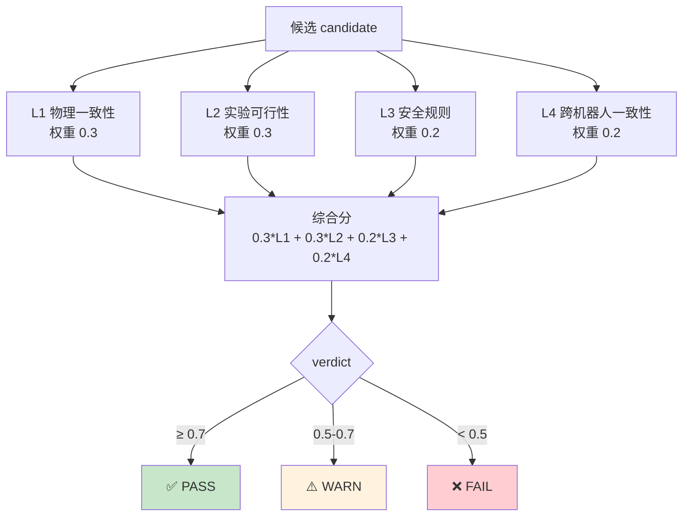

| 路 | 检查什么 | 失败例子 |
|---|---|---|
| **L1 物理** | 能量守恒 / Bragg / 晶格常数 | 能量异常 / 峰位不符 |
| **L2 合成** | 成本 / 设备可达 / 时间 | 超预算 / 缺设备 |
| **L3 安全** | Co / Be / 放射性限制 | 含 Co / 含 Be |
| **L4 跨机器人** | 多表征结果一致 | XRD 与 DSC 矛盾 |

---

## 📍 W4-4: Demo 演示指引

> **Demo 脚本**:`docs/teaching_manual/03_demo_scripts/W4_critic_L1L4.py`

### 测试 1:pass 候选(LiFePO4)

```
verdict: PASS, overall = 0.85
L1 物理:        0.90
L2 合成:        0.80
L3 安全:        0.90
L4 跨机器人:    0.70
```

### 测试 2:故意 fail(含 Co)

```
verdict: FAIL, overall = 0.45
...
L3 安全:        0.10    ← 触发"no Co"约束
```

### 测试 3:故意 L4 不一致

```
verdict: WARN, overall = 0.62
...
L4 跨机器人:    0.30    ← 同一材料不同表征矛盾
```

---

## 📍 W4-5: 课堂互动

### 提问 1(3 分钟)
> "L1-L4 权重为什么是 0.3 / 0.3 / 0.2 / 0.2?"
> - L1 + L2 = 物理 + 合成(都重要,各 0.3)
> - L3 = 安全(最低 0.2,但**违反即 fail**)
> - L4 = 跨机器人(辅助,0.2)

### 提问 2(3 分钟)
> **现场改权重**:老师改 `L1 = 0.5, L3 = 0.1`,让学生看 verdict 变化

### 提问 3(4 分钟)
> **为什么 LLM 复核不影响 verdict?**
> - 规则说了算 = **可复现**
> - LLM 提建议 = **可解释**
> - fail-soft = LLM 挂了 verdict 仍正常

---

## 📍 W4-6: LLM 复核(W7 详细,这里先提)

```python
# 默认 False(W33 设计)
agent = MatCriticAgent()

# 启用 LLM 复核(需要 MATWAU_LLM_API_KEY + MATWAU_LLM_ENABLED=1)
agent = MatCriticAgent(enable_llm_review=True)
```

> 💡 **W4 不需要配 LLM**(默认 False);W7 才教如何配。

---

## 📍 W4-7: 上机 + 作业

### 上机(90 分钟)

```bash
# 1. 跑 demo(10 分钟)
python3 docs/teaching_manual/03_demo_scripts/W4_critic_L1L4.py

# 2. 故意改 candidate(20 分钟)
# 让 1 个含 Co 的候选 → fail
# 看 L3 怎么扣分

# 3. 改权重(30 分钟)
# 改 L1 = 0.5, L3 = 0.1,看 verdict 变化

# 4. 写"为什么 LLM 不改 verdict" 的解释(30 分钟)
```

### 课外作业(5 小时)

1. **解释 L1-L4 4 路打分**(50 分):每路写 200 字
2. **故意制造 fail 场景**(30 分):让 1 个含 Co 候选 fail
3. **改 critic 权重实验**(20 分):改 1 组权重,解释后果

> 📅 **下节课(W5)**:多实验编排(mat-orchestrator)

---

# W5 — 多实验编排(mat-orchestrator)

---

## 📍 W5-1: 上节回顾 + 本节目标

> ✅ **W4 回顾**:
> - 4 路打分模型
> - pass / warn / fail 三态
> - LLM 复核不影响 verdict

> 🎯 **W5 目标**:
> 1. 理解"DAG"和"并行"
> 2. 跑通 `run_batch()` 多实验并行
> 3. 理解 ThreadPoolExecutor + 异常隔离

---

## 📍 W5-2: 单实验 vs 批实验

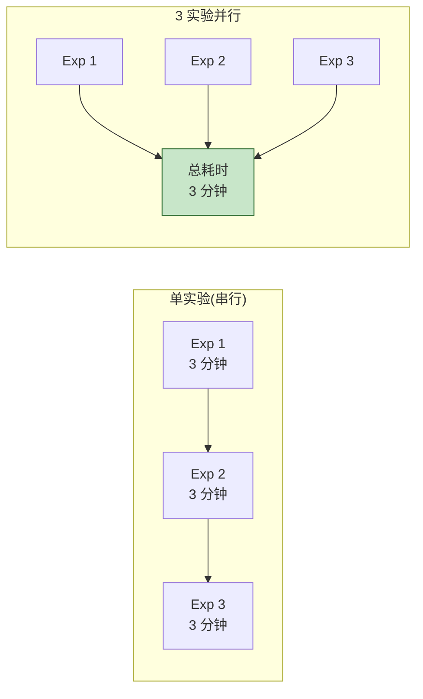

> 💡 **并行加速比**:3 个实验从 9 分钟 → 3 分钟(理论 3x)

---

## 📍 W5-3: mat-orchestrator 架构

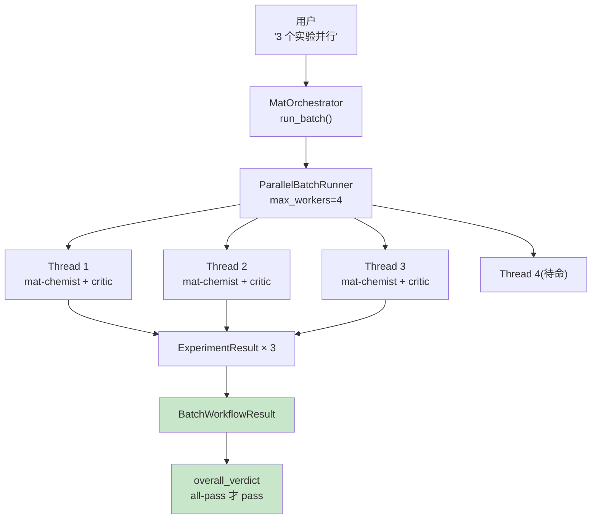

---

## 📍 W5-4: 异常隔离(失败不传染)

```python
# ParallelBatchRunner._safe_run
try:
    return fn()  # 跑实验
except Exception as e:
    return ExperimentResult(
        verdict="fail",
        error=f"{type(e).__name__}: {e}",
    )
```

> 💡 **关键设计**:1 个实验 fail → 只该实验 fail,不影响其他

---

## 📍 W5-5: Demo 演示指引

> **Demo 脚本**:`examples/multi_experiment_demo.py`

```bash
cd /opt/matwau
python3 examples/multi_experiment_demo.py
```

**预期输出**:
```
🚀 MatWAU W31 Stage 3 JARVIS Demo — 3 实验并行

📊 BatchWorkflowResult
  N = 3, passed = 3, warned = 0, failed = 0
  Overall verdict: PASS
  Total cost: ¥4500
  Total duration: ~3 分钟(并行)vs 9 分钟(串行)

  - Inconel 718: verdict=PASS, L4=0.78
  - PMMA:       verdict=PASS, L4=0.85
  - TiO2:       verdict=PASS, L4=0.72
```

### 对比 parallel=True / False

```python
# parallel=True:3 分钟(并行)
batch = orch.run_batch(experiments, parallel=True, max_workers=4)

# parallel=False:9 分钟(串行)
batch = orch.run_batch(experiments, parallel=False)
```

---

## 📍 W5-6: 课堂互动 + 作业

### 提问 1(3 分钟)
> "为什么用 ThreadPoolExecutor 而不是 ProcessPool?"
> - mat-chemist + critic = I/O-bound(网络 / DB)
> - ThreadPool:**共享内存 + 轻量**(4 worker 就够)
> - ProcessPool:**CPU-bound 才用**(这里不需要)

### 提问 2(4 分钟)
> "max_workers=1/4/8 哪个最快?"
> - 1 worker = 串行
> - 4 workers = 推荐(覆盖 4 robot 类型上限)
> - 8 workers = **不一定更快**(调度开销)

### 上机 + 作业

**上机(90 分钟)**:跑 demo + 改 parallel + 故意让 1 个 fail

**课外作业(5 小时)**:
1. **编排 2 并行**(30 分):自定义 2 个 ChemistTask,跑通
2. **时长对比**(30 分):parallel=True/False 各 5 次,取平均
3. **max_workers 曲线**(40 分):1/4/8 各测一次,画图

> 📅 **下节课(W6)**:血缘与可观测(mat-data-lineage)

---

# W6 — 血缘与可观测(mat-data-lineage)

---

## 📍 W6-1: 上节回顾 + 本节目标

> ✅ **W5 回顾**:
> - DAG + 并行
> - ThreadPoolExecutor
> - 异常隔离

> 🎯 **W6 目标**:
> 1. 理解"为什么科研需要血缘记录"
> 2. 查 LineageStore(SQLite / Postgres)
> 3. 写 1 段 lineage 报告

---

## 📍 W6-2: 为什么需要 lineage?

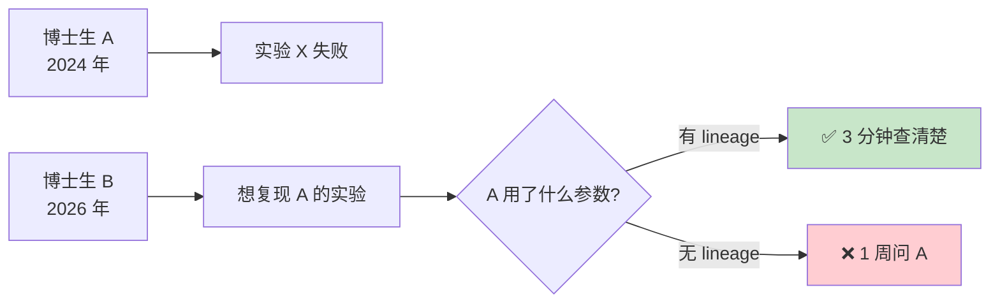

> 💡 **核心价值**:**可复现 + 可审计 + 可追溯**

---

## 📍 W6-3: LineageStore 数据模型

| 字段 | 类型 | 含义 |
|---|---|---|
| `experiment_id` | str | 实验 ID(uuid4)|
| `agent` | str | 哪个 agent(mat-gen / sim / critic ...)|
| `input_summary` | dict | 输入(材料名 / 参数)|
| `output_summary` | dict | 输出(能量 / verdict)|
| `metadata` | JSONB | 任意 JSON 元数据 |
| `timestamp` | datetime | 时间戳 |

> 💾 **后端**:SQLite(默认,零部署)或 Postgres(生产,支持并发)

---

## 📍 W6-4: 演示查 lineage

```bash
# 1. 跑 1 个 demo(自动写 lineage)
python3 examples/multi_experiment_demo.py

# 2. 查 SQLite
sqlite3 ~/.matwau/lineage.db "SELECT experiment_id, agent, timestamp FROM lineage_records LIMIT 10;"

# 3. 通过 HTTP API 查(学院版 docker 部署后)
curl http://localhost:8080/lineage
```

---

## 📍 W6-5: 课堂互动 + 作业

### 提问 1(3 分钟)
> "SQLite vs Postgres 学院版怎么选?"
> - **教学**:SQLite(零部署,文件式)
> - **生产**:Postgres(学院 IT 部署 docker compose 自带)
> - **迁移**:`MATWAU_PG_DSN` 环境变量切换

### 上机 + 作业

**上机(90 分钟)**:跑 demo + 查 SQLite + (可选)切 Postgres

**课外作业(4 小时)**:
1. **导出 lineage JSON**(50 分):跑 1 个 demo,导出 3 个 experiment 的 lineage
2. **写报告**(50 分):300 字解释"为什么可复现对科研重要"

> 📅 **下节课(W7)**:LLM 二次复核(mat-critic-agent + LLM)

---

# W7 — LLM 二次复核(mat-critic-agent + LLM)

---

## 📍 W7-1: 上节回顾 + 本节目标

> ✅ **W6 回顾**:
> - 血缘记录的价值
> - SQLite vs Postgres

> 🎯 **W7 目标**:
> 1. 理解"LLM 辅助科研"边界
> 2. 配置 DeepSeek API key
> 3. 跑 `enable_llm_review=True`

---

## 📍 W7-2: LLM 在 critic 中的角色

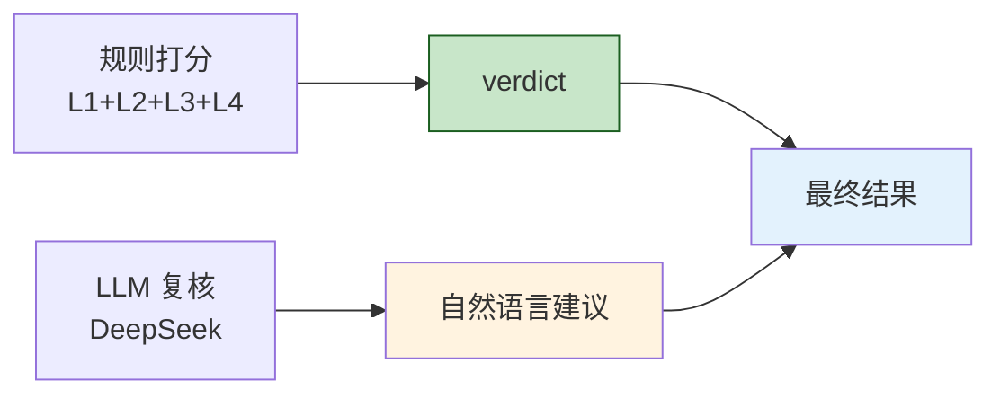

> 💡 **关键**:
> - 规则说了算 = **可复现**
> - LLM 给建议 = **可解释**
> - LLM 挂了 = verdict 不变(fail-soft)

---

## 📍 W7-3: 配置 DeepSeek

```bash
# 1. 学院 IT 配 1 个 API key(W37.2 教学手册有详细步骤)
export MATWAU_LLM_API_KEY="sk-xxxxxxxx"
export MATWAU_LLM_BASE_URL="https://api.deepseek.com"
export MATWAU_LLM_MODEL="deepseek-v4-flash"
export MATWAU_LLM_ENABLED="1"

# 2. 启用 LLM 复核
python3 -c "
from agents.mat_critic_agent import MatCriticAgent
agent = MatCriticAgent(enable_llm_review=True)
print('LLM ready:', agent._llm_reviewer.is_available())
"
```

> ⚠️ **API key 不进对话**(per `feedback-hf-token-leak`)

---

## 📍 W7-4: fail-soft 兜底矩阵

| 条件 | 结果 |
|---|---|
| 无 `MATWAU_LLM_API_KEY` | `is_available()` = False → 跳过 |
| 无 `openai` 包 | `is_available()` = False → 跳过 |
| `MATWAU_LLM_ENABLED=0` | 跳过 |
| API 调用失败 | `result.review=""`, verdict 不变 |
| LLM 空响应 | 同上 |
| LLM 超时 | 同上 |

---

## 📍 W7-5: Demo 演示(扩展 W4)

```python
# 拿 W4 demo,改成:
from agents.mat_critic_agent import MatCriticAgent, LLMReviewer

reviewer = LLMReviewer(api_key="k", enabled=True, client=mock_client)
agent = MatCriticAgent(enable_llm_review=True, llm_reviewer=reviewer)
```

**预期输出**(对比):
- 默认(无 LLM):只 verdict
- 启用 LLM:verdict + 🤖 LLM 复核建议 + cost

---

## 📍 W7-6: 课堂互动 + 作业

### 提问 1(3 分钟)
> "LLM 复核会不会改 verdict?"
> - ❌ **不会**(规则说了算)
> - ✅ 只给**自然语言建议**(解释 + 提醒)
> - fail-soft = LLM 挂了 verdict 不变

### 上机 + 作业

**上机(90 分钟)**:配置 LLM + 跑 demo + 故意配错 key 看 fail-soft

**课外作业(4 小时)**:
1. **跑 1 case with LLM**(50 分):开 + 关各 1 次,对比输出
2. **价值解释**(30 分):200 字"LLM 复核的价值"
3. **fail-soft 实验**(20 分):故意配错 key,看 verdict

> 📅 **下节课(W8)**:期末项目(自选 5 方向)

---

# W8 — 期末项目(自选)

---

## 📍 W8-1: 上节回顾 + 期末项目说明

> ✅ **W7 回顾**:
> - LLM 复核的角色
> - DeepSeek 配置 + fail-soft

> 🎯 **W8 目标**:
> 1. 自选 1 个方向做期末项目
> 2. 设计 + 实现 + 答辩(10 分钟)

---

## 📍 W8-2: 5 个选题方向

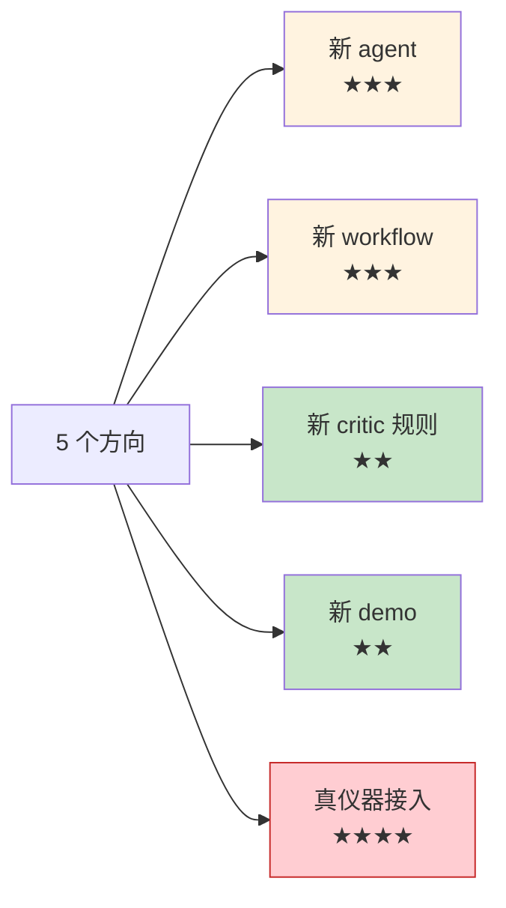

| 方向 | 难度 | 例子 | 分值上限 |
|---|---|---|---|
| **新 agent** | ★★★ | mat-tensile-agent | 25 分 |
| **新 workflow** | ★★★ | 聚变堆材料评估 pipeline | 25 分 |
| **新 critic 规则** | ★★ | 相图自洽规则 | 22 分 |
| **新 demo** | ★★ | 钙钛矿太阳能电池材料筛选 | 22 分 |
| **真仪器接入**(挑战)| ★★★★ | 替换 mock SDK 为真仪器 | **30 分** |

---

## 📍 W8-3: 项目要求

### 必交 4 件

| 件 | 要求 |
|---|---|
| **代码** | 可运行 + 提交 PR 到学院 fork |
| **测试** | ≥ 5 个单元测试 + 1 个 demo |
| **文档** | 1 页 README + 5 分钟 PPT |
| **答辩** | 10 分钟讲 + 5 分钟问 |

### 评分维度(30 分)

| 维度 | 满分 |
|---|---|
| 代码 + 测试 | 12 分 |
| 文档 + PPT | 9 分 |
| 答辩 | 9 分 |

---

## 📍 W8-4: 时间表(1 周)

| 时间 | 工作 |
|---|---|
| Day 1-2 | 选题 + 设计 + 实现 |
| Day 3-4 | 测试 + 文档 + PPT |
| Day 5-6 | 自测 + 答辩演练 |
| Day 7(答辩日)| 10 分钟讲 + 5 分钟问 |

---

## 📍 W8-5: 答辩模板

```markdown
# 我的期末项目:[标题]

## 1. 我做了什么(2 分钟)
- 目标:[要解决的问题]
- 方法:[用了哪些 agent / workflow]
- 结果:[跑通 + 数据]

## 2. 关键技术(3 分钟)
- 架构图(Mermaid)
- 核心代码
- 测试结果

## 3. 创新点(2 分钟)
- 与现有方案对比
- 独特之处

## 4. 反思 + 下一步(3 分钟)
- 遇到的困难
- 学到什么
- 未来方向

## 5. 现场 demo(5 分钟 Q&A)
- 跑 1 个 end-to-end demo
- 回答评委问题
```

---

## 📍 W8-6: 课程总结

### 8 周你学到的 7 类能力

1. ✅ **材料学基础**(XRD / DSC / Bragg 定律)
2. ✅ **AI 工具使用**(17 agent / prompt / context)
3. ✅ **Python 工程**(dataclass / type hint / pytest)
4. ✅ **自动化思维**(DAG / 并行 / 异常隔离)
5. ✅ **跨学科协作**(合成 + 表征 + 模拟)
6. ✅ **数据治理**(LineageStore 自动接线)
7. ✅ **批判性思维**(4 路打分 + LLM 复核)

### 后续路线图

```
W37 学院版(v1.0-Academic → v1.1-Academic)
  ↓
W37.6 课堂 PPT(本次)
  ↓
v1.2-Academic(2027 Q1)
  ↓
你 = MatWAU 学院版第 N 号贡献者 🚀
```

---

## 📍 W8-7: 答疑 + 课程结束

> 🎓 **恭喜你完成了 8 周 MatWAU 学院版课程!**
>
> 📜 **证书**:学院教务处出(可选)
>
> 🤝 **贡献**:欢迎 fork 学院内部仓,提交 PR
>
> 📧 **联系**:GitHub Issues / `support@xplorealpha.example`

---

**end of slides_8week.md**

> 编写日期:2026-07-26
> 配套版本:MatWAU v1.0-Academic
> License:Apache 2.0
> 总页数:~50 张"PPT 页"(8 周 × 5-7 页)
> 配套使用:Mar 19 / Slidev / GitHub Markdown 渲染
> 受众:老师讲课 + 学生打印讲义