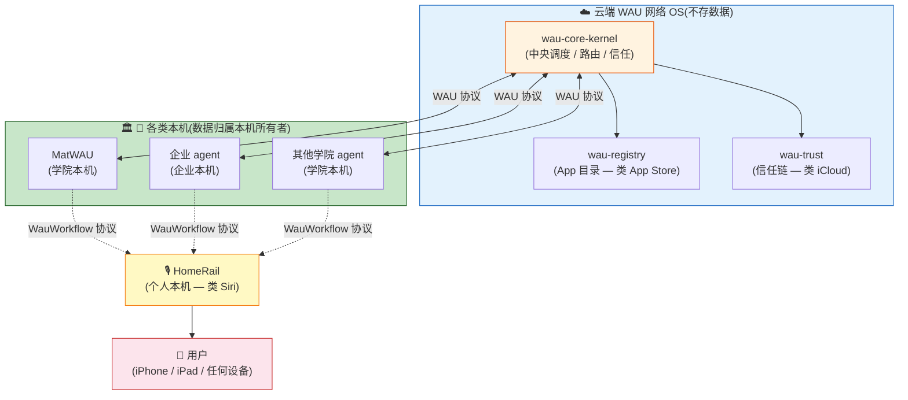
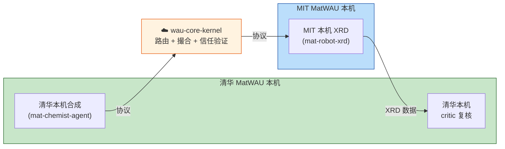
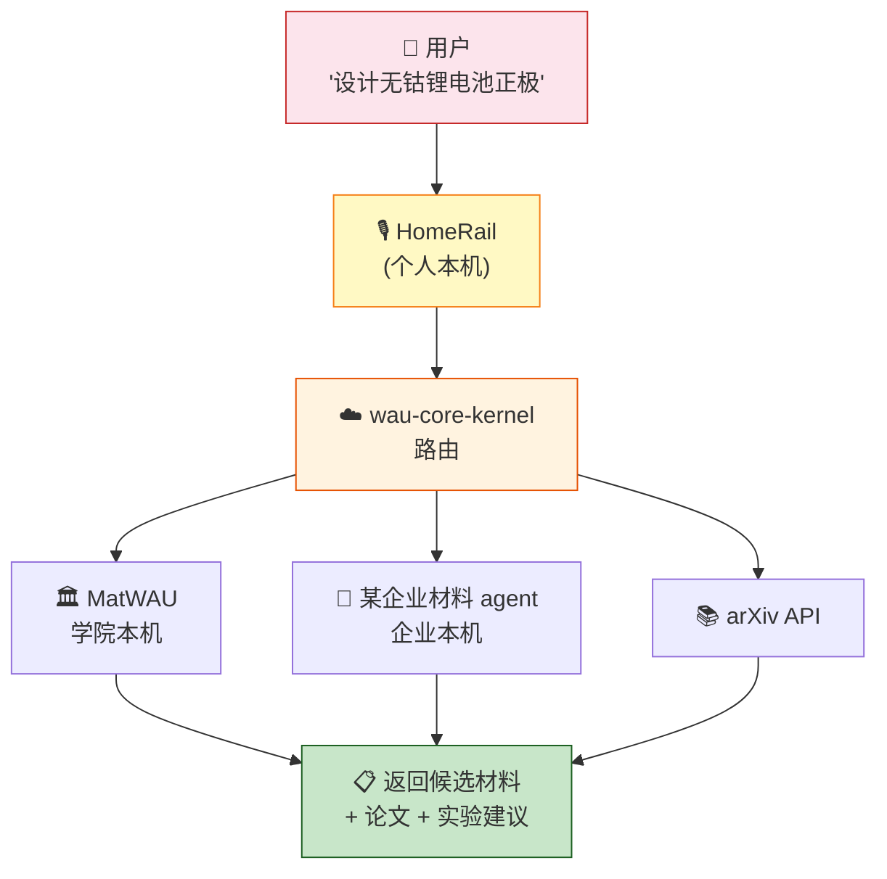

# MatWAU v2.0-Academic 愿景(2027 Q3+)

> **状态**: 愿景草案
> **详细规划**: `~/WAU-develop/develop-log/MatWAU/v2.0/MatWAU-v2.0-Academic-VISION-20260726.md`
> **配套版本**: 基于 v1.2-Academic
> **触发条件**: v1.2 跑通 + ≥ 2 所学院 + ≥ 1 企业 + 协议标准化 + 商业模式决策

---

## 一句话定位

**v2.0 = "WAU 网络 OS + App 生态 + Siri 入口"的学院版成形**

**类比 Apple**:
- **wau-core-kernel** = iOS
- **MatWAU / 企业 / 学院 agent** = 各种 App
- **HomeRail** = Siri
- **每个本机** = iPhone / iPad

---

## 三方角色(清晰边界)

| 角色 | 部署位置 | 数据归属 |
|---|---|---|
| **wau-core-kernel** | ☁️ 云端 | 公开(只调度)|
| **MatWAU / 企业 / 其他学院 agent** | 🏛️ 🏢 本机 | **本机所有者** |
| **HomeRail** | 🏠 个人本机 | **个人** |

**核心原则**: 云端不存数据,各本机数据不出本机,跨域协作通过协议。

---

## 典型场景(想象)

### 场景 A:学院 A 跨校合作

> 清华发起:"我要测 Inconel 718 高温蠕变" → kernel 撮合 MIT(Bruker XRD 空闲 + 博士生 Bob)→ MIT 本机跑 XRD → 数据回流清华本机 critic 复核

### 场景 B:HomeRail Siri 入口

---

## v2.0 触发条件(5 件齐全才启动)

| 条件 | 状态 |
|---|---|
| v1.2-Academic 跑通 ≥ 1 学期 | 待启动 |
| ≥ 2 所学院使用 MatWAU | 待发生 |
| ≥ 1 个企业 agent 接入 wau-core-kernel | 待发生 |
| wau-protocol-spec 跨域 RPC 标准化 | 待发生 |
| 商业模式决策完成(开源 / 授权 / 联合)| 待决定 |

---

## 与 v1.x 的本质变化

| 维度 | v1.x | v2.0 |
|---|---|---|
| 范围 | 单本机自给自足 | 多本机协同 |
| 学院 | 1 所 | 多所 |
| 用户 | 学院 / 个人 | 学院 / 企业 / 个人 |
| 定位 | **工具** | **生态** |

---

## 风险与边界

| 风险 | 边界 |
|---|---|
| 云端单点 | HA + 脱机模式 |
| 多学院协议分歧 | wau-protocol-spec 强制标准化 |
| 商业 vs 学院 IP 争议 | 协议层明确 IP 归属 |
| 治理单点 | 联合维护委员会 |

---

## 详细愿景

详见:[`~/WAU-develop/develop-log/MatWAU/v2.0/MatWAU-v2.0-Academic-VISION-20260726.md`](file:///home/inamoto888/WAU-develop/develop-log/MatWAU/v2.0/MatWAU-v2.0-Academic-VISION-20260726.md)(394 行 / 16 节 / 全本地)

---

**end of v2.0-vision.md**

> **愿景**: "WAU = 网络版 iOS + App 生态 + Siri 入口"
> **下一站**: v1.2-Academic 实施(等学院反馈)
> **维护**: XploreAlpha 团队